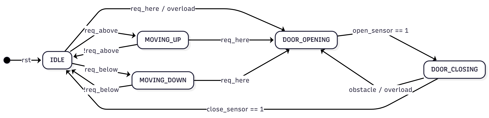

# elevator_4floor
fsm for 4 floor elevator model

A Verilog-based RTL design of a 4-floor elevator controller utilizing the SCAN algorithm. This project focuses on handling concurrent asynchronous floor requests using bitmask memory and modeling realistic physical door limit switches.

## 📂 Repository Structure
As seen in `image_695389.png`, the repository is structured to separate different architectural approaches:

```text
├── melay_model/      # Initial FSM (Mealy) - outputs driven by state + inputs
├── moore_model/      # Strict Moore FSM - split door states, glitch-free outputs
├── README.md
└── LICENSE
```

## 🏗️ Architecture & FSM (Moore Version)

> **Note:** The state diagram below specifically represents the **Moore machine** implementation located in the `moore_model/` directory, which splits the door sequence into two distinct states to maintain strict state-dependent outputs.



## 🧠 Design Evolution: Mealy vs. Moore

I initially designed this project as a **Mealy machine** where datapath flags (`door_is_closing`) and external inputs directly dictated outputs within a single `door` state. 

To analyze architectural trade-offs, I later refactored the design into a strict **Moore machine**. 
* **The Difference:** I eliminated internal directional flags and split the door logic into `DOOR_OPENING` and `DOOR_CLOSING` states. Outputs now strictly depend on the active state flip-flops, ensuring glitch-free combinational outputs at the cost of one extra state bit.

## 🛠️ Challenges Overcome & RTL Highlights

* **Concurrent Request Handling (SCAN Algorithm):** Standard binary inputs drop simultaneous requests. I decoupled the routing logic from the inputs by implementing a 4-bit `pending_reqs` register. It latches asynchronous button presses chronologically via bitwise OR and clears them dynamically upon floor arrival.
* **Realistic Limit Switch Modeling:** Removed impossible simultaneous input conditions. The FSM now correctly relies on distinct limit-switch toggles and interrupt-driven safety mechanisms (obstacle/overload).
* **Combinational Look-Ahead Routing:** Designed continuous sweep logic (`req_above`, `req_below`) that evaluates the bitmask relative to the `currentfloor`. This prevents the motor from stuttering and maintains direction until all requests in a path are fulfilled.

## 📊 Simulation & Synthesis 
*(Coming Soon)*
* **Simulation:** Icarus Verilog waveforms demonstrating concurrent request handling and obstacle interrupts.
* **Synthesis:** Yosys/Vivado hardware resource utilization (LUTs, Registers) comparing the Mealy and Moore implementations.
